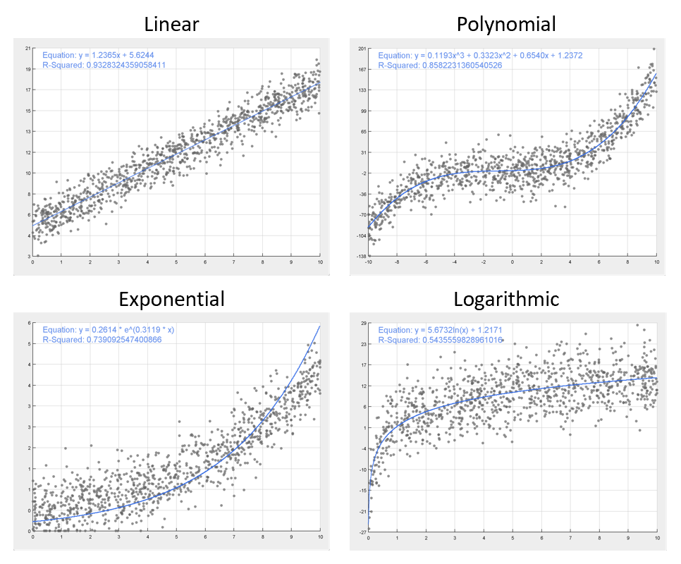

# Least Squares Regression

This repository provides an efficient implementation of the ordinary least squares regression algorithm in Java. The implementation allows for the computation of the least squares estimate of the parameters for a regression model given input predictors and a response variable, evaluation using the $R^2$ coefficient, and graphing of the least squares solution along with the input data for univariate regressors.

This code supports least squares analysis for models that are linear in their parameters, i.e. linear regression and multiple linear regression as well as polynomial and logarithmic regression through a change of basis. Additionally, the least squares estimate of an exponential model, $y = ae ^{bx}$, is approximated by solving the linear system $ln (y) = ln(a) + bx$.

## Demonstration
Below, find a demonstration of the implemented least squares algorithm. Plotted are regression models fit on data sampled from linear, polynomial, exponential, and logarithmic processes with added Gaussian noise.

## Implementation
To improve efficiency and numerical stability, the least squares estimate is computed using the Gram-Schmidt process to generate a QR decomposition of the data matrix and back-substitution to solve the resulting system. This implementation garners signficant improvements in the numerical stability and speed of computations.
